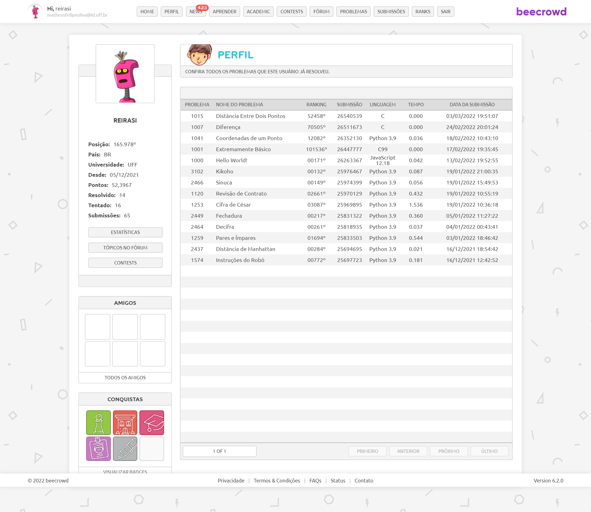
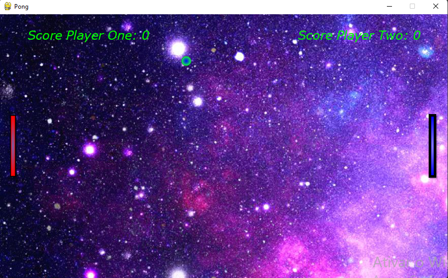
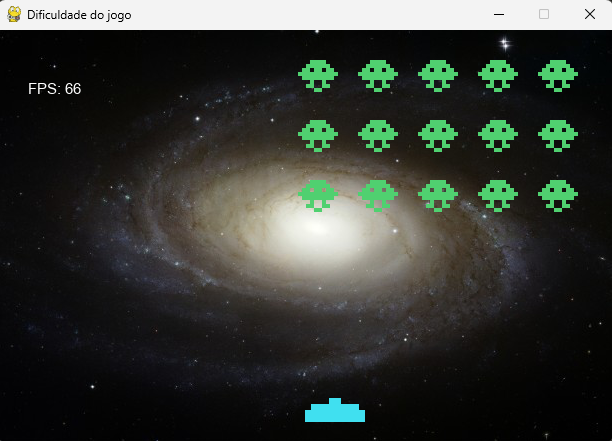
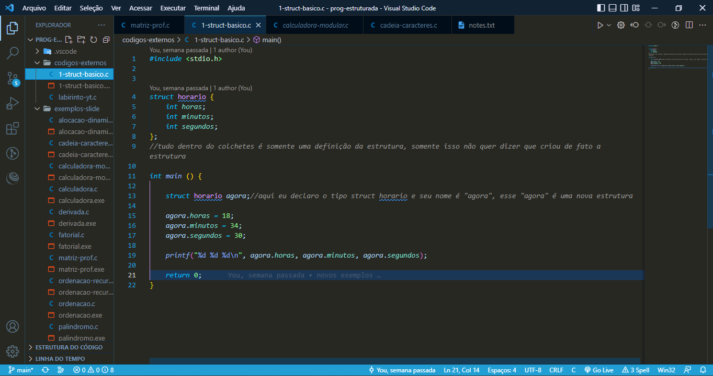

    
          
    <h1 align="right">📖 Minha trajetória na faculdade. </h1>

 
    Uma pequena representação da minha passagem no curso de ciência da computação e o que eu conquistei durante esse fase.

  

  

# 🤓 Laboratório de resolução de problemas

    Professor: Antônio Kowada

    Casos realizados:
     
    

  

# 🎮 Laboratório de jogos

    <h2>
        Professor:
    </h2>
    

        Esteban Walter
    

    <h2>
        Casos realizados
    </h2>
     
    
    

  

# 🧬 Programação estruturada

    <h2>
        Professor
    </h2>
    

        Anselmo Antunes
    

    <h2>
        Casos realizados
    </h2>
     
    

